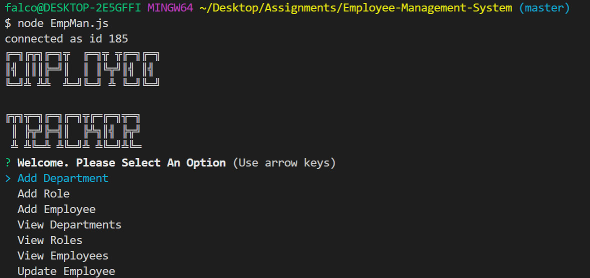

# Employee-Management-System

## Description

a command-line CMS application using javascript, Node.js, inquirer, and MySQL that allows the user to manage a company's employees by:  
Adding departments, roles, employees
Viewing departments, roles, employees
Updating employee roles

## User Story

As a business owner
I want to be able to view and manage the departments, roles, and employees in my company
So that I can organize and plan my business

## Installation

Clone Repo
npm i
run schema.sql in MySQL Workbench
run Emp_seeds.sql\* (for testing)
node EmpMan.js

## Usage

Choose to Add Dept, Role or Employee
Or Choose to View Depts, Roles or Employees
Or Choose to Update Employee Role.
When Updating Employee, view list of Employees and their Title, then select which employee to update and select which role they are moving to.

## Example Video

[Video link](https://drive.google.com/file/d/1Ia77Xd9Td8zi7DlrGyPmli-OkcMAFAhK/view)

## Screenshots

## Learn More

[GitHub](https://github.com/falconreid/Employee-Management-System)
[LinkedIn](https://www.linkedin.com/in/joelterrell/)

### Logo Generator

Thanks to http://patorjk.com/software/taag/ for the ASCII logo generator
